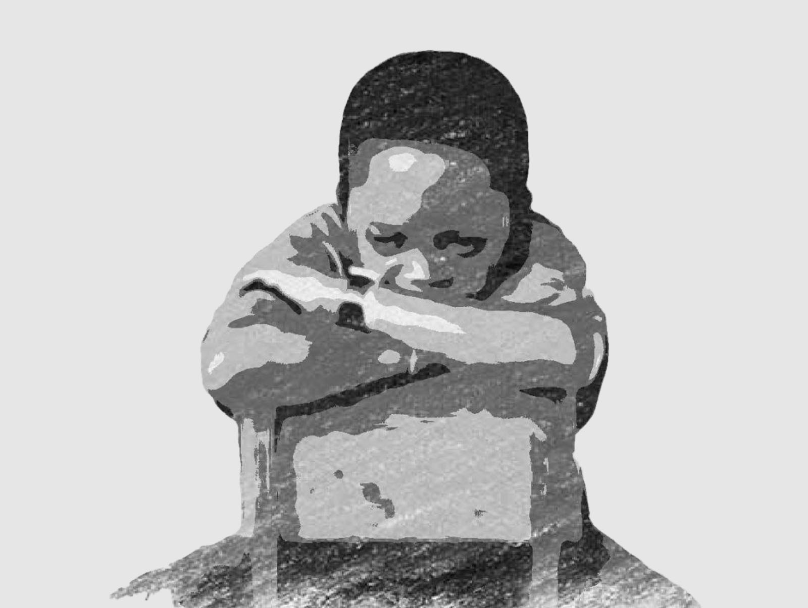

#### Who am I?

My name is Wilfred.

I'm a Notion fan, I'm interested in programming with Python,and I also enjoy reading books, listening to podcasts and watching movies (dying out). 
I'm currently reading Medicine in school.

  

#### Why start a blog?

I started this blog because I want to . . .
  - express myself 
  - get better at writing
  - learn more about stuff
  - share things I discover with others
  - practise what I learn in web development
  

Also, I started it because I really wanted to start something like this and see how it all turns out.

**\*\*** You may want to check out my [public Notion page](https://oorbeng.notion.site) if you're a medical student. Let me know if you find some of the stuff there useful.

#### How was this blog made?

I did not build everything from scratch; I only tweaked one or two things in [Sat Naing](https://github.com/satnaing)'s [AstroPaper](https://astro.build/themes/details/astro-paper/).